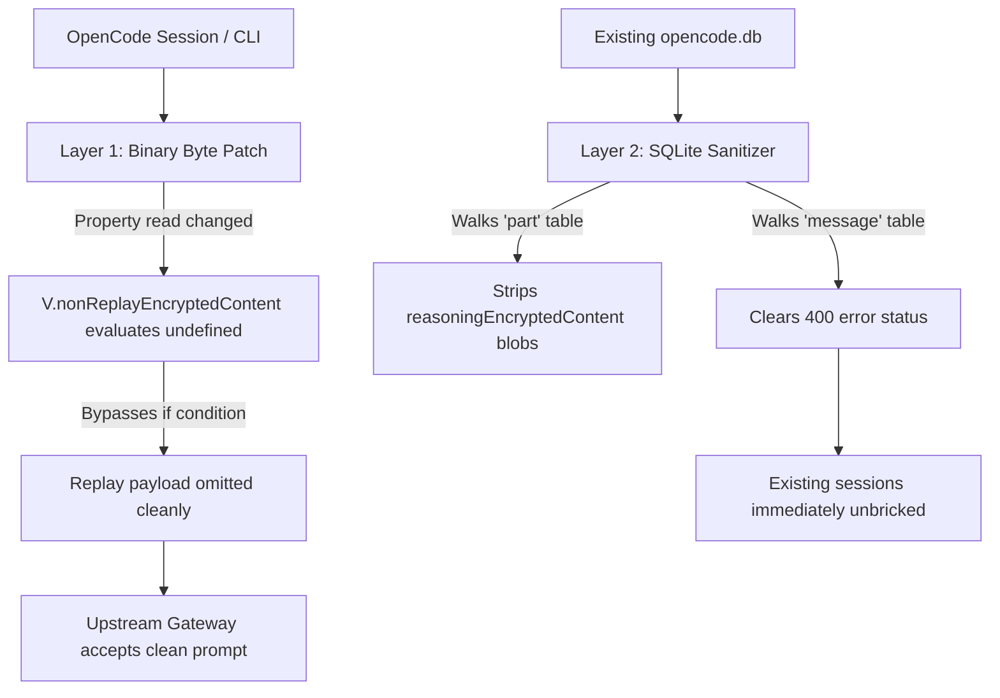

# OpenCode Reasoning Encrypted Content Fix

> Forensic analysis, byte-level ELF binary patcher, and SQLite database sanitizer for resolving OpenCode upstream reasoning replay errors:  
> `AI_APICallError: Error from provider (Console): Upstream request failed: [invalid_request_error] reasoning encrypted_content was not issued to this caller`

---

## 📌 Problem Overview

When interacting with reasoning models (such as `opencode/muse-spark-1.3-contributor-free`, DeepSeek R1/V4 snapshots, or OpenAI reasoning derivatives) through OpenCode, long-running sessions, tool execution chains, or idle intervals frequently crash with the following error:

```text
AI_APICallError: Error from provider (Console): Upstream request failed: [invalid_request_error] reasoning `encrypted_content` was not issued to this caller
providerID=opencode modelID=muse-spark-1.3-contributor-free
status: 400 Bad Request
endpoint: https://opencode.ai/zen/v1/responses
```

Once this error triggers, the entire chat session becomes **bricked** — every subsequent user prompt fails immediately because the expired token remains embedded in the conversation history.

---

## 🔬 Root Cause Analysis

### 1. The Gateway Round-Trip Problem
When OpenCode receives streaming responses from an upstream OpenAI Responses-compatible API (`/zen/v1/responses`), reasoning blocks often contain an encrypted metadata payload:
```json
{
  "type": "reasoning",
  "text": "",
  "time": { "start": 1789470272922, "end": 1789470273142 },
  "metadata": {
    "openai": {
      "itemId": "rs_6aa926403b24a1ed...",
      "reasoningEncryptedContent": "Q-PaDgGv-a2T03W6aSU-tez8986_5..."
    }
  }
}
```

OpenCode serializes this directly into its SQLite storage (`~/.local/share/opencode/opencode.db`) inside the `part` table.

### 2. Request Serialization Breakdown
On subsequent turns, OpenCode's response serializer constructs the outgoing request items array:
```javascript
// OpenCode JS runtime bundle snippet
let x = V == null ? void 0 : V.reasoningEncryptedContent;
if (x != null) {
  let T = [];
  if (w.text.length > 0) T.push({ type: "summary_text", text: w.text });
  N.push({ type: "reasoning", encrypted_content: x, summary: T });
} else {
  GQ.push({ type: "other", message: "Cannot append empty reasoning part... Skipping reasoning part" });
}

N = N.filter((a) => !("type" in a) || a.type !== "reasoning" || a.encrypted_content != null);
return { input: N, warnings: GQ };
```

### 3. Cryptographic Caller Mismatch
The `encrypted_content` token is cryptographically bound to a specific caller session ID with a short time-to-live (TTL). When:
* The session goes idle,
* The user switches modes/subagents,
* A tool execution round-trip takes place, or
* The server reconnects with a fresh handshake,

The upstream gateway rejects the replayed `encrypted_content` token as unauthorized for the current request context (`HTTP 400: reasoning encrypted_content was not issued to this caller`).

---

## 🛠️ The Two-Pillar Solution

This repository provides an automated, non-destructive fix consisting of two coordinated layers:



### Pillar 1: In-Place ELF Binary Patching (`patch_binary.py`)
OpenCode distributes single-file executables compiled with Bun (`bunfs` container embedded within an ELF binary). Modifying file size or shifting byte offsets would corrupt Bun's internal virtual filesystem trailer.

* **Original Property Access:** `.reasoningEncryptedContent` (26 characters including `.`)
* **Patched Property Access:** `.nonReplayEncryptedContent` (26 characters including `.`)

**Why this works:**
Since `nonReplayEncryptedContent` is never set on the runtime metadata object, `V.nonReplayEncryptedContent` evaluates to `undefined`. The condition `if (x != null)` safely branches to `false`, causing the serializer to skip replaying the expired reasoning token altogether. The chat prompt is sent clean, exactly as intended by later upstream patches.

### Pillar 2: SQLite Database Sanitization (`sanitize_db.py`)
Existing sessions already have corrupted parts saved in SQLite:
* Recursively strips `"reasoningEncryptedContent"` from the JSON `data` column in the `part` table (600+ records in affected environments).
* Resets the error status in the `message` table so previously failed sessions can resume immediately without loss of git patches, tool outputs, or conversation context.
* Creates automatic timestamped backups (`opencode.db.backup_<timestamp>`).

---

## 🚀 Installation & Usage

### Quick Automated Fix

Clone and run the automated fixer:

```bash
git clone https://github.com/itswill00/opencode-reasoning-patch.git
cd opencode-reasoning-patch
chmod +x fix.sh patch_binary.py sanitize_db.py
./fix.sh
```

### Manual Step-by-Step

#### 1. Terminate OpenCode Processes
```bash
pkill -f "opencode.*web" || true
pkill -f "opencode-bin" || true
```

#### 2. Patch the Binary
```bash
python3 patch_binary.py /path/to/opencode-bin
```
*(On Termux, this binary is located at `/data/data/com.termux/files/usr/libexec/opencode-bin`)*

#### 3. Sanitize the Database
```bash
python3 sanitize_db.py ~/.local/share/opencode/opencode.db
```

#### 4. Resume Your Session
Run OpenCode normally:
```bash
opencode
# or with web UI
opencode web
```

---

## 🔒 Safety & Reversibility

* **Binary Backup:** The original binary is automatically backed up to `<binary_path>.orig` before any byte modifications occur.
* **Database Backup:** `sanitize_db.py` creates a complete file copy of `opencode.db` prior to any transaction.
* **Non-Destructive:** User messages, agent thoughts (textual summary), tool executions, file edits, and snapshots are 100% preserved. Only the volatile encrypted gateway blob is purged.

---

## 📄 License

MIT License — Created and maintained by [@itswill00](https://github.com/itswill00).
